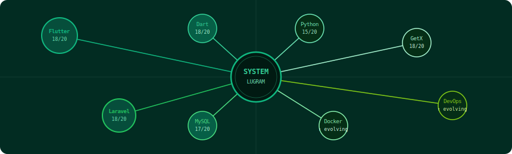

<div align="center">


</div>

<div align="center">

[](https://github.com/LUGRAM)

[](https://github.com/LUGRAM)

[](https://github.com/LUGRAM)

<br/>


</div>

---

## ◼ SYSTEM OVERVIEW

```
This is not a profile.
This is a living system.
```

LUGRAM builds **reactive, scalable, production-grade digital systems**
engineered for **real-world African environments**.

> Mobile-first · Flow-driven · Payment-aware · Constraint-optimized

---

## ◼ SKILL MATRIX

<div align="center">

### 🟢 CORE SYSTEM — Production


```
Flutter / Dart   ████████████████████  18/20  advanced
Laravel / PHP    ████████████████████  18/20  advanced
GetX / State     ████████████████████  18/20  advanced
MySQL / APIs     ██████████████████░░  17/20  advanced
```

---

### 🌱 EXTENSION LAYER — Intermediate


```
Python           ███████████████░░░░░  15/20  intermediate
Java             ███████████████░░░░░  15/20  intermediate
Filament v3      ████████████████░░░░  16/20  intermediate
```

---

### 🌼 EVOLUTION ENGINE — Learning


```
Docker / DevOps  ██████████░░░░░░░░░░  10/20  ↑ evolving
Ansible / CI-CD  ████████░░░░░░░░░░░░   8/20  ↑ evolving
Distrib. Systems █████░░░░░░░░░░░░░░░   5/20  ↑ evolving
```

</div>

---

## ◼ LIVE METRICS

<div align="center">






</div>

---

## ◼ FEATURED SYSTEM — ESchoolPay

```
A transactional ecosystem.
Not just an app.
```

- Multi-entity system (schools / children / accounts)
- Payment orchestration (Mobile Money)
- Real-time tracking
- Secure authentication

```
[ User ] → [ Flutter Interface ] → [ Laravel Core ] → [ Data + Payments ]
```

---

## ◼ SYSTEM DYNAMICS

<div align="center">

<svg width="100%" height="80" viewBox="0 0 600 80" xmlns="http://www.w3.org/2000/svg">
  <line x1="0" y1="40" x2="600" y2="40" stroke="#D1FAE5" stroke-width="1" opacity="0.5"/>
  <circle cx="50" cy="40" r="6" fill="#10B981">
    <animate attributeName="cx" from="0" to="620" dur="4s" repeatCount="indefinite"/>
    <animate attributeName="opacity" values="0;1;1;0" dur="4s" repeatCount="indefinite"/>
  </circle>
  <circle cx="150" cy="40" r="4" fill="#22C55E">
    <animate attributeName="cx" from="0" to="620" dur="3s" begin="0.8s" repeatCount="indefinite"/>
    <animate attributeName="opacity" values="0;1;1;0" dur="3s" begin="0.8s" repeatCount="indefinite"/>
  </circle>
  <circle cx="250" cy="40" r="5" fill="#84CC16">
    <animate attributeName="cx" from="0" to="620" dur="5s" begin="1.5s" repeatCount="indefinite"/>
    <animate attributeName="opacity" values="0;1;1;0" dur="5s" begin="1.5s" repeatCount="indefinite"/>
  </circle>
  <circle cx="350" cy="40" r="3" fill="#6EE7B7">
    <animate attributeName="cx" from="0" to="620" dur="3.5s" begin="2.2s" repeatCount="indefinite"/>
    <animate attributeName="opacity" values="0;1;1;0" dur="3.5s" begin="2.2s" repeatCount="indefinite"/>
  </circle>
</svg>

*Data is not static. It flows.*

</div>

---

## ◼ AFRICAN CONTEXT ENGINE

```
Low bandwidth        →  optimized flows
Mobile-first usage   →  reactive UI
Local payments       →  integrated systems
Unstable networks    →  resilient architecture
```

---

## ◼ ENGINEERING PRINCIPLES

```
Systems > code
Flow > screens
Reality > theory
Constraint = design driver
```

&nbsp;&nbsp;&nbsp;&nbsp;`[∞]` Rigueur mathématique × Engineering pragmatique *(MP/MP\*)*

---

## ◼ CONNECT

<div align="center">

[](https://github.com/LUGRAM)
&nbsp;
[](https://linkedin.com/in/LUGRAM)
&nbsp;
[](mailto:contact@lugram.dev)

</div>

---

## ◼ SYSTEM TOPICS — VISUAL ENGINE

<div align="center">



</div>

---

<div align="center">

</div>
